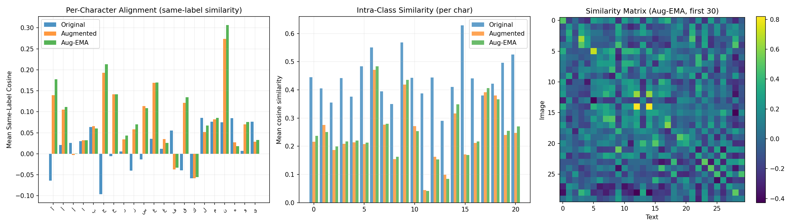
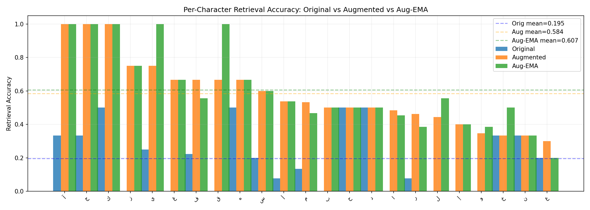
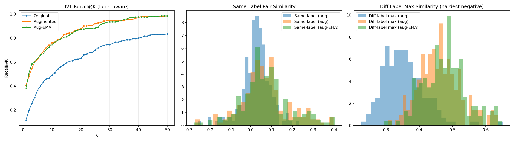

# Calligraphy SigLIP Model

A custom implementation of SigLIP (Sigmoid Loss for Language Image Pre-Training) optimized for calligraphy text recognition. Built from scratch using PyTorch with depthwise separable convolutions for image encoding and a transformer for text encoding.

## 🎯 Overview

This project demonstrates end-to-end deep learning for calligraphy recognition:

- **Custom Image Encoder**: Efficient depthwise separable convolutions designed for calligraphy visual features
- **Transformer Text Encoder**: Modern transformer architecture for text representation learning
- **SigLIP Training**: Sigmoid loss-based contrastive learning for image-text alignment
- **Real-World Data**: Trained on both synthetic and authentic handwritten calligraphy

## 📊 Dataset
To address data insufficiency, we augmented our dataset by synthesizing calligraphy images from hand-picked fonts.
| Source | Count |
|--------|-------|
| Synthetic (Font Visualization) | 1,578 |
| Handwritten Calligraphy | 2,500 |
| **Total** | **4,078** |

**Authentic Dataset Repository**: [ARBML/Calliar](https://github.com/ARBML/Calliar) , I collected the rest using some automation and revision process

## Model Architecture

Both encoders are implemented in `siglip_modules.py`:

**Image Encoder**
- Input: Greyscale images in shape `(B, 1, H, W)` where B is batch size
- Output: Image embeddings

**Text Encoder**
- Input: Text sequences in shape `(B, L)` where L is sequence length
- Text is mapped using the vocabulary mapper from `datasetimg.np` (access via `mapper` key)
- Output: Text embeddings

## Pre-trained Weights

Pre-trained weights are provided as two separate checkpoints: standard training weights (`SIGLIP_standard.pt`) and Exponential Moving Average weights (`SIGLIP_ema.pt`, recommended for evaluation/inference).

### Loading Standard Weights
```python
import torch

checkpoint = torch.load('SIGLIP_standard.pt')

image_encoder_weights = checkpoint['Iencoder']
text_encoder_weights = checkpoint['Tencoder']
classification_head_weights = checkpoint['Chead']
temperature = checkpoint['t_prime']  # learned temperature
bias = checkpoint['b']  # learned bias
config = checkpoint['config']

```

### Loading EMA Weights (Recommended for Inference)

```python
import torch

checkpoint = torch.load('SIGLIP_ema.pt')

# Directly loads the EMA-smoothed encoder and head weights
image_encoder_weights = checkpoint['Iencoder']
text_encoder_weights = checkpoint['Tencoder']
classification_head_weights = checkpoint['Chead']
temperature = checkpoint['t_prime']
bias = checkpoint['b']
config = checkpoint['config']

```
## Results/Performance


The model successfully learns to align calligraphy images with their text representations, trained on:
- 2k synthetic calligraphy images (font visualization)
- 2.5k real handwritten samples

The learned embeddings enable:
- Image-to-text retrieval
- Text-to-image matching
- Calligraphy text recognition
- Image-to-Image similarity
##EDIT:
UPDATED MODEL USING BETTER WAY TO TRAINING AND ADDED EMA , i found no big difference between ema and normal , i added augmentation and larger batch size for better learning since siglip scales with negatives compared to positives , and added caption head , and made its loss scaled up cause I care about per letter encoding too so i prioritized that letters are preserved as much as possible in embeddings i had better results , i will show later 
## Issues


While testing abit i found out that the model has problem with arabic caligraphy with tashkeel and multiple words sentences, working on building another synthetic data to fix the issue


##Images/results:

 
 



these are after augs compared to the unaugmented one , and the ema of the auged one  

## Installation

Clone the repository:
```bash
git clone https://github.com/beastreader/caligraphy-siglip-module.git
cd caligraphy-siglip-module
```


## Contact

Built by [@beastreader](https://github.com/beastreader)
- Email: mahmoudgalal621@gmail.com
